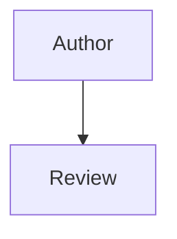

# Contributing

Thank you for helping maintain Health New Zealand's engineering principles and standards.

## Scope

A principle or standard **MUST** only cover what its [target audience](README.md#target-audience) should consider for the topic it addresses. Content describing Health New Zealand's internal governance or process **MUST NOT** be included, even if it relates to that topic; if it needs to be documented, it belongs elsewhere, not in this repository.

## Proposing Changes

New principles or standards, and changes to existing ones, **MUST** be proposed via merge request.

## Structure

Each principle and standard **MUST** follow this structure:

- **Summary**: one plain-text sentence capturing the core idea, directly under the title.
- **Principles** or **Standards**, matching the topic's type: normative requirements grouped into logical subsections.
- **References**: relative Markdown links to related principles and standards, listed at the end of the subsection rather than cited inline.

Normative requirements **MUST** use the language defined in the `README`'s [Documentation Terminology](README.md#documentation-terminology) section.

## Review

Merge requests **MUST** be reviewed and approved by a code owner listed in [`CODEOWNERS`](CODEOWNERS) before merging.

## Adding or Changing a Page

A new principle or standard needs both a content file and a navigation entry:

- Add new principle or standard Markdown files under the matching domain folder (`docs/principles/` or `docs/standards/<category>/`), following the structure above.
- Add page metadata at the top of each new or changed page so the published footer shows the last edited date:

	```yaml
	---
	last_edited: YYYY-MM-DD
	---
	```

	`last_edited` **MUST** be the date the page content was last materially changed, not the build date. A site build regenerates every page, so build time **MUST NOT** be used as a proxy for content age. A non-trivial edit **MUST** update this value.
- Every new page **MUST** also be added to the `nav:` section of `mkdocs.yml`. Navigation is a hand-maintained list, not auto-discovered from the folder structure; place the new entry alongside related pages in reading order.
- A new top-level standards category also needs its own `index.md` plus a new block under `nav:`.

## Local Build and Preview

The site is built directly from this repository with [MkDocs](https://www.mkdocs.org/) and [Material for MkDocs](https://squidfunk.github.io/mkdocs-material/); the local build requires [`uv`](https://docs.astral.sh/uv/) and Python 3.13+.

- `make init` installs project dependencies with `uv`.
- `make serve` starts MkDocs' local live-reloading server at `http://127.0.0.1:8000/`.
- `make build` builds the static site into `public/`.

GitLab CI only runs once a merge request is merged into the default branch; it does not validate an open merge request beforehand, so check a change locally with `make serve` or `make build` before merging.

## Mermaid Diagrams

Use native Mermaid fenced blocks in standards markdown:

~~~text

~~~

Mermaid diagrams are rendered by Material for MkDocs' built-in support, configured via `pymdownx.superfences` in `mkdocs.yml`. The `privacy` plugin already in `mkdocs.yml` downloads and self-hosts the Mermaid script at build time, so no CDN reference or extra step is needed here.
