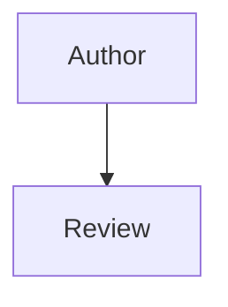

# Contributing

Thank you for helping maintain Health New Zealand's engineering principles and standards.

## Scope

A principle or standard **MUST** only cover what its [target audience](README.md#target-audience) should consider for the topic it addresses. Content describing Health New Zealand's internal governance or process **MUST NOT** be included, even if it relates to that topic; if it needs to be documented, it belongs elsewhere, not in this repository.

## Proposing Changes

New principles or standards, and changes to existing ones, **MUST** be proposed via merge request.

## Documentation Types

Choose the documentation type according to the purpose of the content:

- A **principle** states a value and explains why it matters. It gives standards their basis and guides decisions that no specific standard covers. Principles do not create obligations or prescribe products, tools, versions, or thresholds.
- A **standard** applies an aspect of a principle through an unambiguous, verifiable obligation. It states what must be true and uses RFC 2119 language to express the strength of each obligation.

## Structure

Each file covers a topic and may contain more than one principle or standard grouping. Keep each principle or grouping in a separate `##` section.

### Principle Format

```markdown
# <Topic Name>

## <Principle Name>

### Summary

<One sentence stating the value.>

### Reasoning

<Why the value matters.>

### Implemented By These Standards

- [<Standard>](<relative-path>)
```

### Standard Format

```markdown
# <Topic Name>

## <Standard Grouping Name>

### Summary

<One sentence stating the required outcome.>

### Standards

1. `std-<category>-<grouping>-<nn>` <One verifiable obligation.>

### Exceptions

<Optional. Include only when a genuine exception exists.>

### Related Standards

- [<Standard>](<relative-path>)

### Implements These Principles

- [<Principle>](<relative-path>)
```

`Exceptions` and `Related Standards` are optional. Omit them when they do not add relevant information.

Standard obligations **MUST** use the language defined in the `README`'s [Documentation Terminology](README.md#documentation-terminology) section.

## AGENTS Files

When using an AI agent to change documentation, provide this contributing guide and the `AGENTS.md` file for the relevant documentation type. The scoped file defines the structure, voice, relationships, and checks the agent must apply:

- [`docs/principles/AGENTS.md`](docs/principles/AGENTS.md) applies to principle content.
- [`docs/standards/AGENTS.md`](docs/standards/AGENTS.md) applies to standard content.

The `AGENTS.md` files supplement this guide; they do not replace its contribution and review requirements.

## Review

Merge requests **MUST** be reviewed and approved by a code owner listed in [`CODEOWNERS`](CODEOWNERS) before merging.

## Adding or Changing a Page

When adding or changing a principle or standard:

- Create or update the Markdown file in the relevant category under `docs/principles/` or `docs/standards/`.
- Add this metadata at the top of the page:

	```yaml
	---
	last_reviewed: YYYY-MM-DD
	review_cycle: 12 months
	---
	```

	`last_reviewed` **MUST** be the date the page content was reviewed and confirmed as current, not the build date. A site build regenerates every page, so build time **MUST NOT** be used as a proxy for content age.
- Every new page **MUST** also be added to the `nav:` section of `mkdocs.yml`. Navigation is a hand-maintained list, not auto-discovered from the folder structure; place the new entry alongside related pages in reading order.
- A new top-level standards category also needs its own `index.md` plus a new block under `nav:`.

## Local Build and Preview

The site is built directly from this repository with [MkDocs](https://www.mkdocs.org/) and [Material for MkDocs](https://squidfunk.github.io/mkdocs-material/); the local build requires [`uv`](https://docs.astral.sh/uv/) and Python 3.13+.

- `make init` installs project dependencies with `uv`.
- `make serve` starts MkDocs' local live-reloading server at `http://127.0.0.1:8000/`.
- `make build` builds the static site into `public/`.

GitLab CI only runs once a merge request is merged into the default branch; it does not validate an open merge request beforehand, so check a change locally with `make serve` or `make build` before merging.

## Mermaid Diagrams

Use native Mermaid fenced blocks in standards markdown:

~~~text

~~~

Mermaid diagrams are rendered by Material for MkDocs' built-in support, configured via `pymdownx.superfences` in `mkdocs.yml`. The `privacy` plugin already in `mkdocs.yml` downloads and self-hosts the Mermaid script at build time, so no CDN reference or extra step is needed here.
