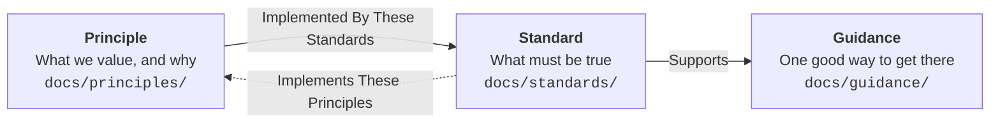

# Health New Zealand Engineering Standards
<!--include-start-->

## Purpose

These engineering principles and standards guide how software and services are delivered for Health New Zealand, keeping expectations consistent across projects while allowing implementation details to evolve.

Technology-specific implementation instructions are maintained separately within the organisation's engineering knowledge base.

## Documentation Hierarchy

- A **principle** holds a value statement and its reasoning.
- A **standard** makes one aspect of a principle verifiable.
- **Guidance** provides practical ways to implement standards. It links to the standard and principle it serves under `Supports`.

Both directions are required: every principle names at least one standard under `Implemented By These Standards`, and every standard grouping cites at least one principle under `Implements These Principles`.

### Tags

Every numbered standard and guidance page carries a tag: a short, stable identifier used to cite it without depending on its title, its position on a page, or the path to its file. A `std-` prefix marks a standard's tag and a `gdn-` prefix marks guidance; principles are not tagged and are cited by a link to their page instead.

## Target Audience

These principles and standards apply to everyone involved in the delivery of software and services for Health New Zealand, including vendors, partners, contractors, third parties, and internal staff.

Part A is written for anyone making engineering decisions, including architects, technical leads, and delivery teams weighing a choice no specific standard covers. Part B is written for the engineers designing, building, and operating a specific solution.

## Accountability

Compliance ownership is a standing team responsibility, not a one-time individual task.

- An accountable team **MUST** be assigned for each project or service to own compliance with these principles and standards; accountability **MUST NOT** be attributed to an individual.
- Compliance **MUST** be maintained for the life of a project or service, not only when it was first established.

## Documentation Terminology

In order to enhance the precision and consistency of these engineering principles and standards, we have adopted the terminology defined in [RFC 2119](https://www.rfc-editor.org/rfc/rfc2119.txt). This document provides a set of well-defined terms that convey specific meanings when used in requirements and recommendations.

The key words "MUST", "MUST NOT", "REQUIRED", "SHALL", "SHALL NOT", "SHOULD", "SHOULD NOT", "RECOMMENDED", "MAY", and "OPTIONAL" in this document are to be interpreted as described in RFC 2119.

<!--include-end-->
## Contributing

See [CONTRIBUTING.md](CONTRIBUTING.md) for the required review process, local validation and build commands, and generated-site preview guidance.
