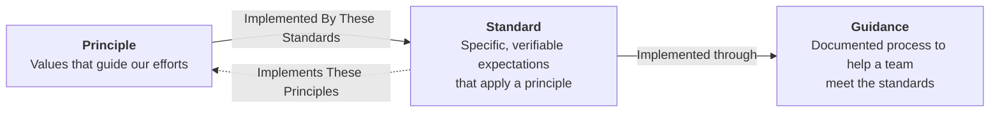

# Health New Zealand Engineering Standards
<!--include-start-->

## Purpose

These engineering principles and standards guide how software and services are delivered for Health New Zealand, keeping expectations consistent across projects while allowing implementation details to evolve.

## Documentation Hierarchy

- **Principles** express the values that guide our engineering efforts and explain why those values matter.
- **Standards** apply principles through specific, verifiable expectations.
- **Guidance** documents a process that helps a team meet the standards in its context. Teams maintain their guidance outside this repository.

Principle pages link to their relevant standards under `Implemented By These Standards`. Standard groups link back to the principles they support under `Implements These Principles`.

### Tags

Use a numbered standard's `std-` tag when citing it. The tag remains stable if the standard's title, position, or page changes. Cite a principle by linking to its page.

## Target Audience

If you contribute to or make decisions about software and services delivered for Health New Zealand, these principles and standards apply to your work. This includes Health New Zealand staff and teams, vendors, partners, contractors, and other third parties.

## Adoption Expectations

For existing projects and services, these principles and standards provide an improvement roadmap rather than a compliance threshold that must be met immediately. Teams should assess their current alignment, prioritise gaps based on risk and value, and make progress toward meeting the standards.

Teams delivering new projects and services are expected to adopt these principles and standards from the outset, using them to guide how their projects and services are designed, built, and operated.

## Documentation Terminology

In order to enhance the precision and consistency of these engineering principles and standards, we have adopted the terminology defined in [RFC 2119](https://www.rfc-editor.org/rfc/rfc2119.txt). This document provides a set of well-defined terms that convey specific meanings when used in requirements and recommendations.

The key words "MUST", "MUST NOT", "REQUIRED", "SHALL", "SHALL NOT", "SHOULD", "SHOULD NOT", "RECOMMENDED", "MAY", and "OPTIONAL" in this document are to be interpreted as described in RFC 2119.

<!--include-end-->
## Contributing

See [CONTRIBUTING.md](CONTRIBUTING.md) for the required review process, local validation and build commands, and generated-site preview guidance.

### AGENTS Files

The `AGENTS.md` files provide scoped authoring instructions for AI agents working with this documentation. They keep changes consistent with the purpose, structure, voice, and linking rules for each documentation type. They are contributor instructions and are excluded from the published site.

- [`docs/principles/AGENTS.md`](docs/principles/AGENTS.md) defines how principles are created and maintained.
- [`docs/standards/AGENTS.md`](docs/standards/AGENTS.md) defines how standards are created and maintained.
- [`docs/guidance/AGENTS.md`](docs/guidance/AGENTS.md) defines the format and boundaries for guidance.

Before changing documentation with an AI agent, direct it to the `AGENTS.md` file for the relevant documentation type.
