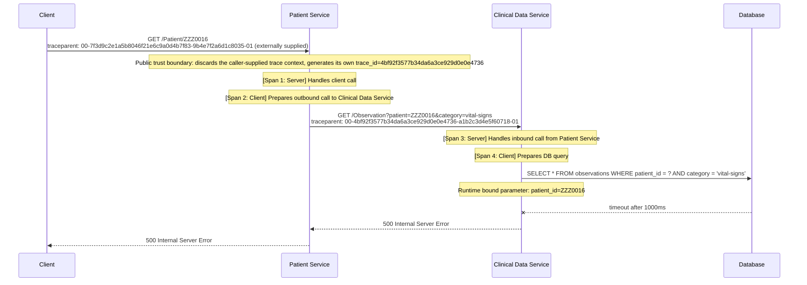

# Distributed Tracing

## Trace Context

### Summary

Valid trace context propagates across downstream boundaries in a standard, interoperable format and is validated at external trust boundaries.

### Standards

1. `std-ops-trace-context-01` A service **MUST** propagate valid trace context to instrumented downstream calls, including across asynchronous boundaries where the transport supports context propagation.
2. `std-ops-trace-context-02` Trace context **SHOULD** be propagated using a standard, interoperable format, such as [W3C Trace Context](https://www.w3.org/TR/trace-context/).
3. `std-ops-trace-context-03` A service receiving trace context from outside its trust boundary **MUST** validate it before propagation.

### Related Standards

- [Telemetry Instrumentation](telemetry-instrumentation.md)
- [Structured Logging](structured-logging.md)

### Implements These Principles

- [Observability](../../principles/reliability-operations/observability.md)
- [Interoperability](../../principles/architecture-platform/interoperability.md)

## Span Structure

### Summary

A trace uses separate, accurately related spans for each side of a service boundary, with low-cardinality names, variable attributes, and failures recorded clearly.

### Standards

1. `std-ops-span-structure-01` A span's start and end boundaries, and its parent-child relationship to other spans, **MUST** reflect the actual call graph of the transaction.
2. `std-ops-span-structure-02` When a call or message crosses between two instrumented services, each instrumented side **SHOULD** record the operation with the appropriate client, server, producer, or consumer span kind.
3. `std-ops-span-structure-03` A single span **SHOULD NOT** represent both sides of a remote boundary.
4. `std-ops-span-structure-04` A span's name **MUST** be consistent and low-cardinality.
5. `std-ops-span-structure-05` A variable value, such as a raw identifier, **MUST** be recorded as a span attribute and excluded from the span name.
6. `std-ops-span-structure-06` A span representing a failed operation **MUST** record the failure according to the applicable semantic convention.

### References

- [OpenTelemetry Tracing API Specification](https://opentelemetry.io/docs/specs/otel/trace/api/)

### Related Standards

- [Telemetry Instrumentation](telemetry-instrumentation.md)

### Implements These Principles

- [Observability](../../principles/reliability-operations/observability.md)

## Sampling

### Summary

A trace's sampling decision is deliberate and consistent across services, with errors and unusually slow traces retained where possible.

### Standards

1. `std-ops-sampling-01` A service **MUST** define how much of its traffic to keep as traces by weighing transaction volume against the value of that data.
2. `std-ops-sampling-02` A service **SHOULD** use parent-based or consistent sampling so downstream decisions remain coherent with propagated sampling state.
3. `std-ops-sampling-03` A service's sampling strategy **SHOULD** retain a trace that contains an error or is unusually slow, even when the normal sampling decision would otherwise have dropped it.

### References

- [OpenTelemetry Sampling Specification](https://opentelemetry.io/docs/specs/otel/trace/sdk/#sampling)

### Related Standards

- [Observability Platform Integration](observability-platform-integration.md)

### Implements These Principles

- [Observability](../../principles/reliability-operations/observability.md)
- [Cost Awareness](../../principles/cost-sustainability/cost-awareness.md)

## Examples

### Failed Cross-Service Request



#### 1. Patient Service: Inbound HTTP Server Span

```json
{
  "name": "GET /Patient/{patientId}",
  "context": {
    "trace_id": "4bf92f3577b34da6a3ce929d0e0e4736",
    "span_id": "8c18abb071ce362d",
    "trace_state": ""
  },
  "parent_id": null,
  "kind": "SPAN_KIND_SERVER",
  "start_time": "2026-08-22T14:25:00.000000Z",
  "end_time": "2026-08-22T14:25:01.050000Z",
  "status": {
    "status_code": "ERROR",
    "description": "Internal Server Error"
  },
  "attributes": {
    "service.name": "Patient Service",
    "http.request.method": "GET",
    "url.path": "/Patient/pt_93810",
    "http.route": "/Patient/{patientId}",
    "http.response.status_code": 500,
    "network.protocol.version": "1.1",
    "user_agent.original": "Mozilla/5.0...",
    "server.address": "patient-service.internal"
  },
  "events": [],
  "links": []
}
```

#### 2. Patient Service: Outbound HTTP Client Span

```json
{
  "name": "GET /Observation",
  "context": {
    "trace_id": "4bf92f3577b34da6a3ce929d0e0e4736",
    "span_id": "a1b2c3d4e5f60718",
    "trace_state": ""
  },
  "parent_id": "8c18abb071ce362d",
  "kind": "SPAN_KIND_CLIENT",
  "start_time": "2026-08-22T14:25:00.005000Z",
  "end_time": "2026-08-22T14:25:01.045000Z",
  "status": {
    "status_code": "ERROR",
    "description": "Downstream server returned 500"
  },
  "attributes": {
    "service.name": "Patient Service",
    "http.request.method": "GET",
    "url.full": "https://clinical-data-service.internal",
    "http.response.status_code": 500,
    "server.address": "clinical-data-service.internal"
  },
  "events": [],
  "links": []
}

```

#### 3. Clinical Data Service: Inbound HTTP Server Span

```json
{
  "name": "GET /Observation",
  "context": {
    "trace_id": "4bf92f3577b34da6a3ce929d0e0e4736",
    "span_id": "b2c3d4e5f60718a1",
    "trace_state": ""
  },
  "parent_id": "a1b2c3d4e5f60718",
  "kind": "SPAN_KIND_SERVER",
  "start_time": "2026-08-22T14:25:00.010000Z",
  "end_time": "2026-08-22T14:25:01.040000Z",
  "status": {
    "status_code": "ERROR",
    "description": "Database query timeout"
  },
  "attributes": {
    "service.name": "Clinical Data Service",
    "http.request.method": "GET",
    "url.path": "/Observation",
    "url.query": "?patient=pt_93810&category=vital-signs",
    "http.route": "/Observation",
    "http.response.status_code": 500,
    "server.address": "clinical-data-service.internal",
    "client.address": "10.0.0.5"
  },
  "events": [],
  "links": []
}
```

#### 4. Clinical Data Service to Database: Outbound DB Client Span

```json
{
  "name": "SELECT clinical_db.observations",
  "context": {
    "trace_id": "4bf92f3577b34da6a3ce929d0e0e4736",
    "span_id": "c3d4e5f60718a1b2",
    "trace_state": ""
  },
  "parent_id": "b2c3d4e5f60718a1",
  "kind": "SPAN_KIND_CLIENT",
  "start_time": "2026-08-22T14:25:00.020000Z",
  "end_time": "2026-08-22T14:25:01.020000Z",
  "status": {
    "status_code": "ERROR",
    "description": "context deadline exceeded / timeout"
  },
  "attributes": {
    "service.name": "Clinical Data Service",
    "db.system": "postgresql",
    "db.namespace": "clinical_db",
    "db.query.text": "SELECT * FROM observations WHERE patient_id = ? AND category = 'vital-signs'",
    "db.user": "clinical_app",
    "server.address": "postgres-primary.internal",
    "server.port": 5432
  },
  "events": [
    {
      "name": "exception",
      "timestamp": "2026-08-22T14:25:01.020000Z",
      "attributes": {
        "exception.type": "QueryTimeoutException",
        "exception.message": "Database driver aborted the operation after 1000ms.",
        "exception.stacktrace": "org.postgresql.util.PSQLException: Connection timed out at org.postgresql.core.v3..."
      }
    }
  ],
  "links": []
}
```
