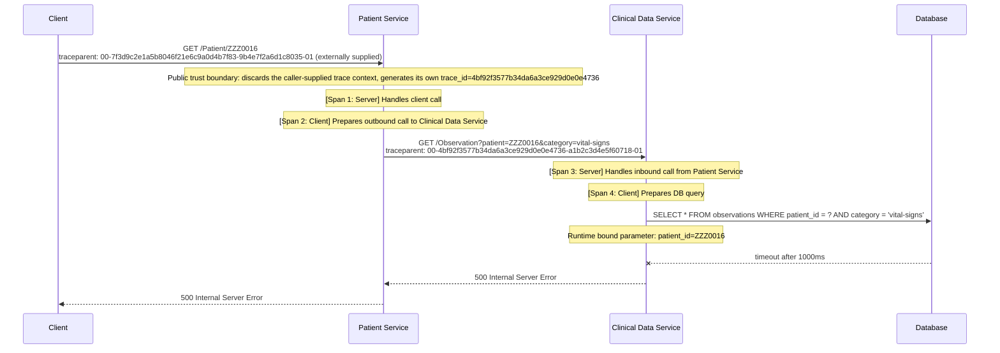

# Distributed Tracing

## Summary

> Propagate trace context end-to-end, structure spans accurately, and sample deliberately.

## Standards

### Trace Context Propagation

> A trace identifier propagates across every boundary a transaction crosses, using a standard, interoperable format.

1. A service **MUST** propagate a transaction's trace identifier, whether carried by the transaction or newly generated, to every downstream call, including one across an asynchronous boundary such as a message queue or event stream.
2. Trace context **SHOULD** be propagated using a standard, interoperable format, such as [W3C Trace Context](https://www.w3.org/TR/trace-context/), rather than a bespoke or service-specific header scheme.
3. A service receiving a request from outside its trust boundary, such as a public-facing API, **SHOULD** generate a new trace identifier at that boundary rather than unconditionally propagate one supplied by the caller.

#### References

- [Interoperability by Design](../../principles/interoperability-by-design.md)
- [Observability by Default](../../principles/observability-by-default.md)
- [Security by Design](../../principles/security-by-design.md)

### Span Structure

> A span's structure mirrors the transaction's real call graph, with a consistent name and any failure clearly recorded.

1. A span's start and end boundaries, and its parent-child relationship to other spans, **MUST** reflect the actual call graph of the transaction.
2. When a call or message crosses between two instrumented services, each side of that crossing **MUST** be recorded as its own span: the client and server for a call, or the producer and consumer for a message. A single span **MUST NOT** represent both sides, so a trace distinguishes an outgoing call from its incoming handling.
3. A span's name **MUST** be consistent and low-cardinality; a variable value, such as a raw identifier, **MUST** be recorded as a span attribute rather than embedded in the span name.
4. A span representing a failed operation **MUST** record that failure, including sufficient detail to identify the cause, so a trace clearly shows where within a transaction it failed.

#### References

- [Telemetry Instrumentation Standards](telemetry-instrumentation-standards.md)
- [OpenTelemetry Tracing API Specification](https://opentelemetry.io/docs/specs/otel/trace/api/)

### Trace Sampling

> A trace's sampling decision is made deliberately once, and every service it passes through honours that same decision.

1. A service **MUST** decide deliberately how much of its traffic to keep as traces, weighing transaction volume against how valuable that data is, rather than keeping or dropping traces without a clear, defined basis.
2. Once a decision is made to keep or drop a trace, every service that transaction passes through **MUST** follow that same decision, rather than each service deciding independently for itself.
3. A service's sampling strategy **SHOULD** retain a trace that contains an error or is unusually slow, even when the normal sampling decision would otherwise have dropped it.

#### References

- [Cost Awareness by Design](../../principles/cost-awareness-by-design.md)
- [OpenTelemetry Sampling Specification](https://opentelemetry.io/docs/specs/otel/trace/sdk/#sampling)

## Illustrative Examples

### Failed Cross-Service Request

This example traces a distributed request across services that ultimately fails due to a downstream database query timeout. It demonstrates trace context propagation, span structure, and sampling in practice.



This end-to-end transaction generates four individual OpenTelemetry spans. The Patient Service to Clinical Data Service crossing, the only hop between two instrumented services, is modelled with a matching `CLIENT` and `SERVER` span pair; the client and database boundaries remain single-sided, since neither the client nor the database is itself an instrumented participant in the trace.

Because the database query timed out, the failure bubbles up the call stack, marking every span in the distributed trace with an `ERROR` status.

The health identifier itself (`ZZZ0016`) is tokenised at the collection layer, in line with each service's sensitive telemetry attribute obligations, so it appears only as `pt_93810` in the spans below.

**Sampling Decision**

The `traceparent` suffix `-01` marks this trace as kept. Even if the head-based sampler had not already selected it, the query timeout and resulting `ERROR` status independently guarantee its retention, so every downstream service still forwards `-01` and the full trace reaches the APM backend.

#### 1. Patient Service: Inbound HTTP Server Span

This is the root span of the distributed trace. It features no `parent_id` because Patient Service sits at the system's public trust boundary and discards the externally supplied trace context rather than propagate it, generating a fresh trace instead.

```json
{
  "name": "GET /Patient/{patientId}",
  "context": {
    "trace_id": "4bf92f3577b34da6a3ce929d0e0e4736",
    "span_id": "8c18abb071ce362d",
    "trace_state": ""
  },
  "parent_id": null,
  "kind": "SPAN_KIND_SERVER",
  "start_time": "2026-08-22T14:25:00.000000Z",
  "end_time": "2026-08-22T14:25:01.050000Z",
  "status": {
    "status_code": "ERROR",
    "description": "Internal Server Error"
  },
  "attributes": {
    "service.name": "Patient Service",
    "http.request.method": "GET",
    "url.path": "/Patient/pt_93810",
    "http.route": "/Patient/{patientId}",
    "http.response.status_code": 500,
    "network.protocol.version": "1.1",
    "user_agent.original": "Mozilla/5.0...",
    "server.address": "patient-service.internal"
  },
  "events": [],
  "links": []
}
```

#### 2. Patient Service: Outbound HTTP Client Span

This span models the outbound boundary crossing from the caller's perspective. It measures the lifecycle of the network request sent to the Clinical Data Service, capturing any transit latencies. Its `span_id` matches the parent block injected into the outbound W3C header.

```json
{
  "name": "GET /Observation",
  "context": {
    "trace_id": "4bf92f3577b34da6a3ce929d0e0e4736",
    "span_id": "a1b2c3d4e5f60718",
    "trace_state": ""
  },
  "parent_id": "8c18abb071ce362d",
  "kind": "SPAN_KIND_CLIENT",
  "start_time": "2026-08-22T14:25:00.005000Z",
  "end_time": "2026-08-22T14:25:01.045000Z",
  "status": {
    "status_code": "ERROR",
    "description": "Downstream server returned 500"
  },
  "attributes": {
    "service.name": "Patient Service",
    "http.request.method": "GET",
    "url.full": "https://clinical-data-service.internal",
    "http.response.status_code": 500,
    "server.address": "clinical-data-service.internal"
  },
  "events": [],
  "links": []
}

```

#### 3. Clinical Data Service: Inbound HTTP Server Span

This server span tracks the execution from the receiver's perspective. It initialises when the Clinical Data Service extracts the incoming W3C `traceparent` header, pointing back to the caller's client span via `parent_id`.

```json
{
  "name": "GET /Observation",
  "context": {
    "trace_id": "4bf92f3577b34da6a3ce929d0e0e4736",
    "span_id": "b2c3d4e5f60718a1",
    "trace_state": ""
  },
  "parent_id": "a1b2c3d4e5f60718",
  "kind": "SPAN_KIND_SERVER",
  "start_time": "2026-08-22T14:25:00.010000Z",
  "end_time": "2026-08-22T14:25:01.040000Z",
  "status": {
    "status_code": "ERROR",
    "description": "Database query timeout"
  },
  "attributes": {
    "service.name": "Clinical Data Service",
    "http.request.method": "GET",
    "url.path": "/Observation",
    "url.query": "?patient=pt_93810&category=vital-signs",
    "http.route": "/Observation",
    "http.response.status_code": 500,
    "server.address": "clinical-data-service.internal",
    "client.address": "10.0.0.5"
  },
  "events": [],
  "links": []
}
```

#### 4. Clinical Data Service to Database: Outbound DB Client Span

This client span tracks the database query driver session, and is where the transaction's failure actually originates. Its `ERROR` status and exception event record the query timeout in enough detail to identify the cause, which the two upstream spans then propagate without needing to repeat. The query text itself is fully parameterised, so no patient identifier appears in this span's telemetry.

```json
{
  "name": "SELECT clinical_db.observations",
  "context": {
    "trace_id": "4bf92f3577b34da6a3ce929d0e0e4736",
    "span_id": "c3d4e5f60718a1b2",
    "trace_state": ""
  },
  "parent_id": "b2c3d4e5f60718a1",
  "kind": "SPAN_KIND_CLIENT",
  "start_time": "2026-08-22T14:25:00.020000Z",
  "end_time": "2026-08-22T14:25:01.020000Z",
  "status": {
    "status_code": "ERROR",
    "description": "context deadline exceeded / timeout"
  },
  "attributes": {
    "service.name": "Clinical Data Service",
    "db.system": "postgresql",
    "db.namespace": "clinical_db",
    "db.query.text": "SELECT * FROM observations WHERE patient_id = ? AND category = 'vital-signs'",
    "db.user": "clinical_app",
    "server.address": "postgres-primary.internal",
    "server.port": 5432
  },
  "events": [
    {
      "name": "exception",
      "timestamp": "2026-08-22T14:25:01.020000Z",
      "attributes": {
        "exception.type": "QueryTimeoutException",
        "exception.message": "Database driver aborted the operation after 1000ms.",
        "exception.stacktrace": "org.postgresql.util.PSQLException: Connection timed out at org.postgresql.core.v3..."
      }
    }
  ],
  "links": []
}
```
